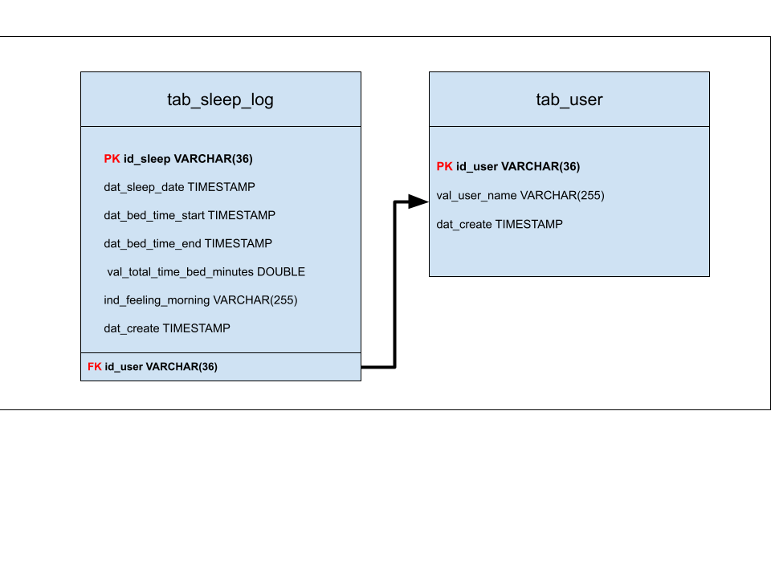

# backend-take-home-test

## Before run the application

You have to start your docker. After that, go to the directory /backend-take-home-test and execute docker-compose -up

Now, go to the /sleep direcotry, and run the application.

## To be tested

In the /backend-take-home-test, I create one directory called NOOM-TEST, It has two files.
The script-to-test file have the basics inserts to test all the endpoints of this API.
Please, execute it before start to test the endpoints.

The 'NOOM CHALLENGE COLLECTION - LEANDRO ZUZA.postman_collection' file has all endpoints prepared to be used in the tests. 
Import it in the Postman.

## Swagger

To access the swagger, go to the link: http://localhost:8080/swagger-ui/index.html

## DER

For my project, I created two tables. The table for keep the sleep logs and other to refer the User to sleep log.

